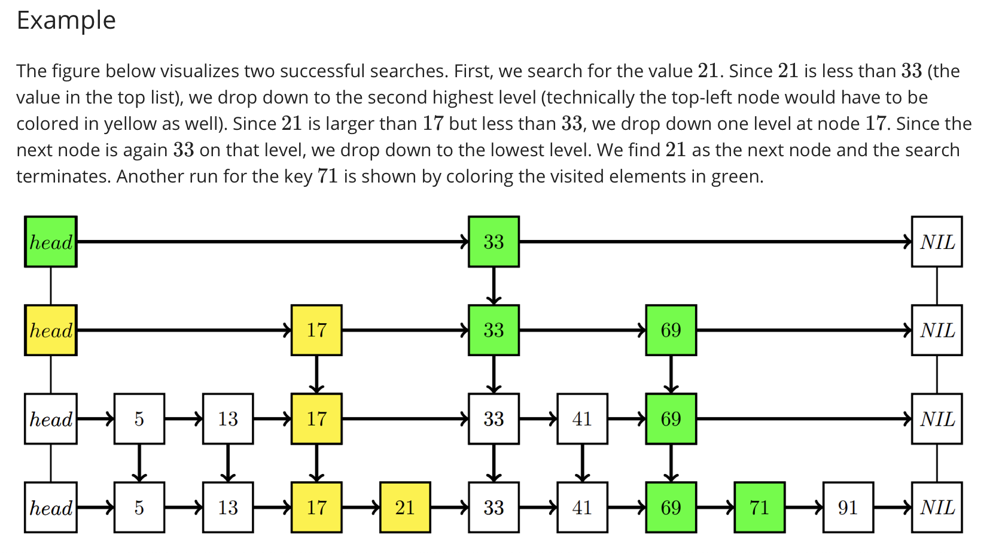
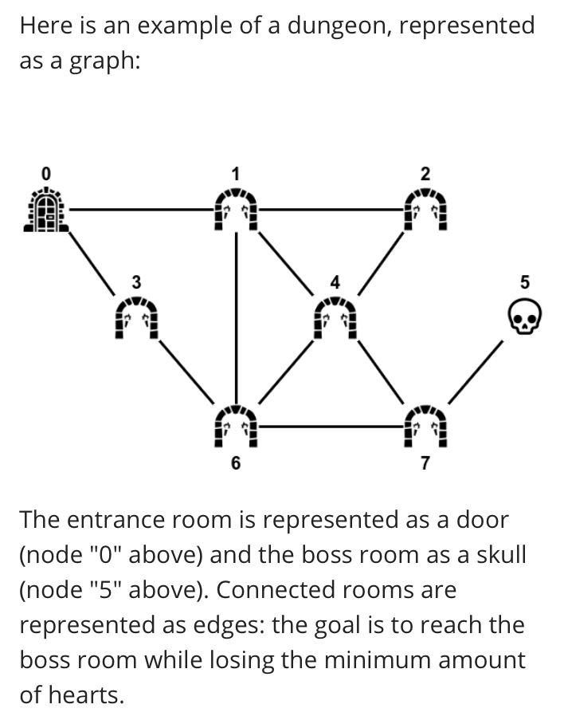

# COMP20007-Projects
Projects of COMP20007 Design of Algorithms. Implementations of various data structures and algorithms in C

## A1 P1
This problem is about implementing a probabilistic data stucture that is based on linked list: leap lists

This includes implementations of 3 main operations: searching, insertion and deletion.

A visualization about the leap lists is shown below, with 2 examples on searching for keys in leap lists

## A1 P2
This problem includes implementation of some data algorithms such as Dijkstra's algorithms, in playing the dungeon exploration game

Below is an example of the graph of the game:

## A2 P2
This is about implementaion on a 2-3-4 tree with some operations.